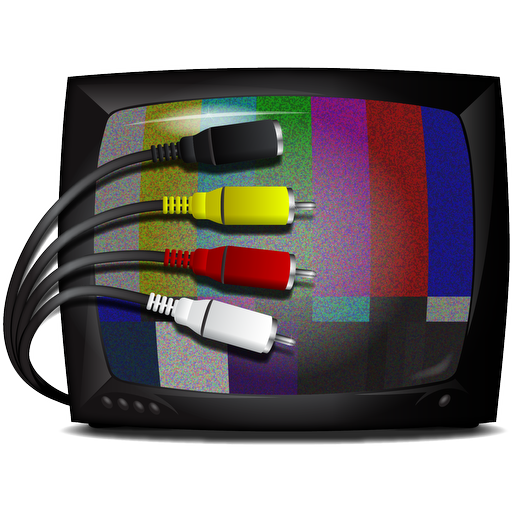
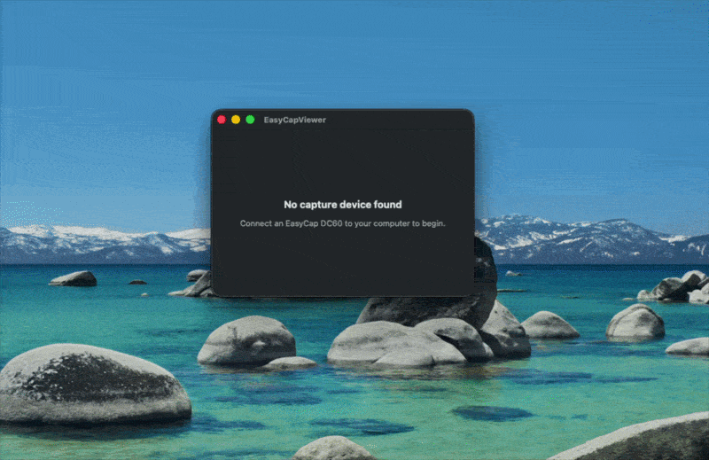

<p align="center">
  
</p>

<h1 align="center">EasyCapViewer</h1>

<p align="center">
  <strong>Capture live video and audio from USB analog capture dongles on macOS</strong>
</p>

<p align="center">
  
</p>

<p align="center">
  <a href="#features">Features</a> &middot;
  <a href="#supported-hardware">Hardware</a> &middot;
  <a href="#installation">Installation</a> &middot;
  <a href="#usage">Usage</a> &middot;
  <a href="#building">Building</a> &middot;
  <a href="#license">License</a>
</p>

---

## Overview

**EasyCapViewer** is a native macOS application for capturing live video and audio from inexpensive USB analog capture dongles — the kind commonly known as "EasyCap" devices. These compact USB devices accept composite (RCA) or S-Video input from analog sources like VCRs, camcorders, security cameras, and game consoles, and convert them to digital video streams.

Built in Objective-C and Swift, EasyCapViewer provides real-time Metal-rendered video preview, configurable deinterlacing, recording to QuickTime movies via AVFoundation, and a dark HUD-style control interface.

---

## Features

### Video Capture
- **Real-time preview** via Metal texture rendering
- **Composite and S-Video** input selection
- **NTSC, PAL, and SECAM** video standards (10 format variants)
- **7 deinterlacing modes**: Progressive, Weave, Line Double HQ/LQ, Alternate, Blur, Drop

### Video Processing
- **Aspect ratio** presets: 4:3, 16:10, 16:9 (and custom)
- **Interactive cropping** with draggable handles and border trimming
- **Brightness, contrast, saturation, and hue** adjustments (device-dependent)
- **Integer scaling**: Half, Actual, and Double size
- **Full-screen mode** with auto-hiding cursor
- **Frame drop indicator** when the system can't keep up

### Audio
- **Live audio monitoring** through system speakers
- **Volume control** with mute toggle
- **Mono-to-stereo upconversion** for devices that output mono audio
- **Audio input selection** from any connected CoreAudio device

### Recording
- **QuickTime .mov** export via AVFoundation with codec and quality selection
- **Frame rate conversion** for recording at different rates than capture
- **Hardware-accelerated codecs**: H.264, HEVC, Motion JPEG, ProRes

### Interface
- **Dark HUD overlay** controls that blend with the video
- **Unified single-window layout** with settings and error log sidebars
- **SwiftUI settings panel** for all video, audio, and image parameters
- **Error log window** with color-coded, timestamped messages
- **Localization** infrastructure (English included)

---

## Supported Hardware

| Chipset | Device Examples | Status |
|---------|----------------|--------|
| **Syntek STK1160** | EasyCap DC60, various generic dongles | Supported |
| **Empia EM2860** | EM2860-based capture devices | Supported |
| **Somagic** | Somagic EasyCap variants | Supported |
| **Fushicai** | Fushicai UTV007 devices | Supported |

| Input | Connector |
|-------|-----------|
| **Composite Video** | RCA jack (yellow) |
| **S-Video** | Mini-DIN 4-pin |
| **Stereo Audio** | RCA jacks (red/white) — device-dependent |

---

## Installation

### Requirements

- **macOS 13.0** (Ventura) or later
- A supported USB capture device
- An analog video source (VCR, camera, console, etc.)

### Download

Pre-built binaries are not yet available. To use EasyCapViewer, build from source using the instructions below.

---

## Usage

1. **Connect** your USB capture device to a USB port
2. **Launch** EasyCapViewer — it automatically detects connected devices
3. **Plug in** your video source (composite or S-Video cable)
4. Click **Play** in the menu bar or press **Space** to start capture
5. Use **Cmd+,** to open the settings panel and adjust video/audio parameters

### Keyboard Shortcuts

| Key | Action |
|-----|--------|
| Space | Toggle play/pause |
| Cmd+F | Toggle full screen |
| Cmd+T | Toggle float on top |
| Cmd+S | Start recording |
| Cmd+. | Stop recording |
| Cmd+Up/Down | Adjust volume |
| Cmd+Opt+Up/Down | Toggle mute |

---

## Architecture

EasyCapViewer uses a **producer-consumer pipeline** with a single-window SwiftUI/AppKit hybrid interface:

```
USB Hardware → ECVCaptureDevice (Metal rendering via MTKView)
                    ↓
              ECVVideoStorage + Deinterlacing
                    ↓
              ECVCaptureSession → fans out to:
                    ├── MainWindowController (video + settings sidebar + error log sidebar)
                    ├── ECVAudioTarget (CoreAudio speakers)
                    └── ECVMovieRecorder (AVFoundation .mov export)
```

Key design: `NSDocument`-based architecture with `@Observable` SwiftUI views for settings, error log, and welcome screen. Metal handles video rendering; AppKit handles interactive crop/play overlays. Thread safety via `ECVReadWriteLock` (pthread_rwlock).

For detailed file-level architecture, see [`AGENTS.md`](AGENTS.md).

---

## Building

### Prerequisites

- **Xcode** with macOS 13+ SDK
- **macOS Ventura** or later (for running)

### Build Commands

```bash
# Debug build
xcodebuild -project EasyCapViewer.xcodeproj \
           -scheme EasyCapViewer \
           -configuration Debug build

# Release build
xcodebuild -project EasyCapViewer.xcodeproj \
           -scheme EasyCapViewer \
           -configuration Release build

# Clean
xcodebuild -project EasyCapViewer.xcodeproj \
           -scheme EasyCapViewer clean
```

### Build Settings

| Setting | Value |
|---------|-------|
| Deployment Target | macOS 13.0 |
| Architecture | Universal (arm64 + x86_64) |
| ARC | Enabled |
| Hardened Runtime | Enabled |
| Sandboxing | Disabled (IOKit USB access required) |

---

## Privacy & Security

- EasyCapViewer accesses USB hardware directly via IOKit, which **cannot run in a sandboxed environment**
- No data is sent to any remote server
- No analytics or telemetry
- Recording creates local .mov files only

---

## License

**BSD 2-Clause License** — Copyright (c) 2009-2013, Ben Trask. All rights reserved.

See [`LICENSE`](LICENSE) for the full license text. Individual source files may contain the original license header.

---

## Credits

[Original Version by Ben Trask](https://github.com/btrask/EasyCapViewer) (2009-2013).
